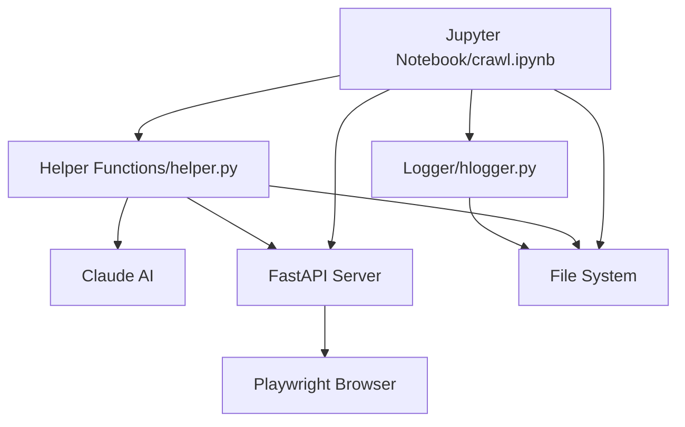
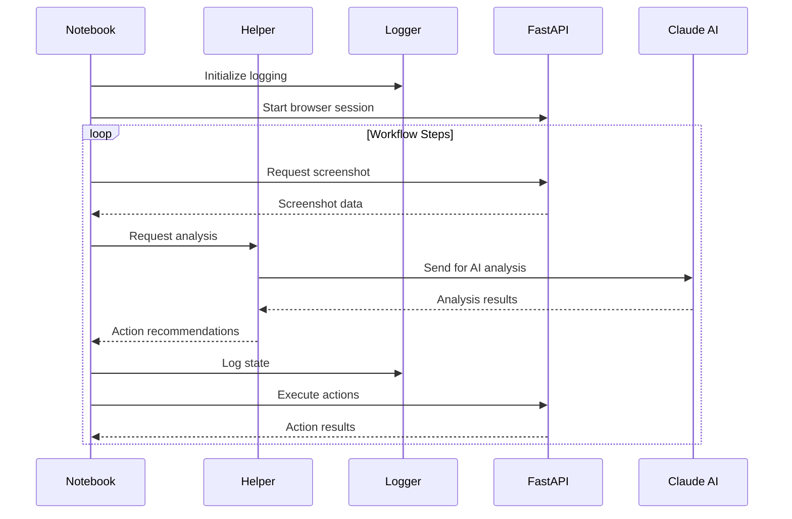

# Architecture Overview

## Core Components



### Component Descriptions

1. **Jupyter Notebook (`crawl.ipynb`)**
   - Primary control center and orchestrator
   - Manages entire workflow execution
   - Coordinates all other components
   - Handles high-level workflow decisions
   - Interacts with FastAPI server for browser control
   - Uses helper functions for analysis
   - Uses logger for state tracking
   - Directly manages file system operations

2. **Helper Functions (`helper.py`)**
   - Primary interface to Claude AI
   - Handles image analysis and processing
   - Contains core decision-making logic
   - Manages coordinate calculations
   - Provides utility functions for notebook
   - Interacts with file system for image handling
   - Makes requests to FastAPI server as needed

3. **Logging System (`hlogger.py`)**
   - Provides hierarchical logging structure
   - Manages state persistence
   - Handles process documentation
   - Controls file system organization
   - Used by all components for tracking

4. **FastAPI Server (`fastAPIServ.py`)**
   - Manages Playwright browser instance
   - Handles browser automation tasks
   - Takes screenshots
   - Executes UI interactions
   - Controlled by notebook and helper functions

## Data Flow

### 1. Main Workflow Flow


## Folder Structure

```
sync-crawl/
├── clients/                   # Managed by Logger
│   └── [client_name]/        # Client-specific data
│       └── [workflow_id]/    # Workflow instances
│           └── [sample_id]/  # Execution samples
├── crawl.ipynb               # Main control notebook
├── fastAPIServ.py           # Browser automation server
├── helper.py                # AI and analysis functions
├── hlogger.py              # Logging system
└── log_config.py           # Logging configuration
```

## Key Processes

### 1. Workflow Execution
1. Notebook initializes workflow
2. Logger creates folder structure
3. Helper prepares for analysis
4. FastAPI server starts browser session
5. Workflow steps execute through notebook

### 2. Analysis Process
1. Notebook requests screenshot via FastAPI
2. Helper receives screenshot for analysis
3. Helper sends to Claude AI
4. Claude AI returns analysis
5. Helper processes results
6. Notebook receives action recommendations

### 3. Logging Process
1. Logger creates hierarchical structure
2. Components send logs to logger
3. Logger manages state persistence
4. Logger organizes artifacts
5. Logger maintains process documentation

## System States

1. **Initialization**
   - Notebook starts workflow
   - Logger creates structure
   - FastAPI connects to browser
   - Helper prepares for analysis

2. **Execution**
   - Notebook orchestrates flow
   - Helper performs analysis
   - FastAPI executes actions
   - Logger tracks state

3. **Error Recovery**
   - Notebook manages recovery
   - Helper analyzes failure
   - Logger maintains state
   - FastAPI resets browser if needed

## Performance Considerations

1. **Resource Management**
   - Notebook controls execution flow
   - Helper manages AI requests
   - FastAPI handles browser resources
   - Logger optimizes file operations

2. **Error Handling**
   - Notebook provides high-level recovery
   - Helper validates analysis
   - FastAPI manages browser stability
   - Logger ensures state consistency

3. **State Management**
   - Notebook tracks workflow progress
   - Helper maintains analysis context
   - Logger persists system state
   - FastAPI maintains browser state