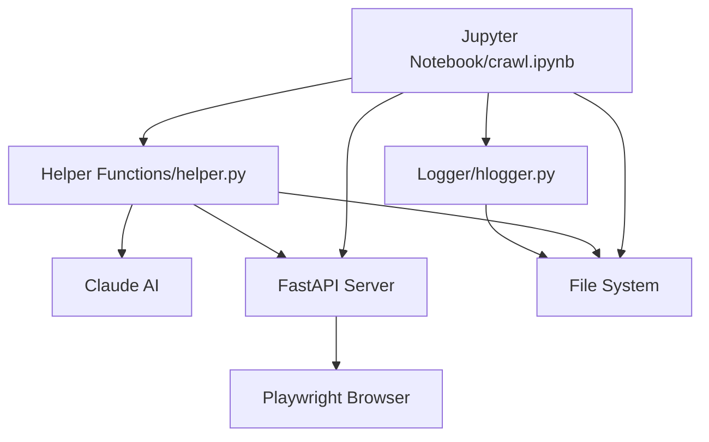
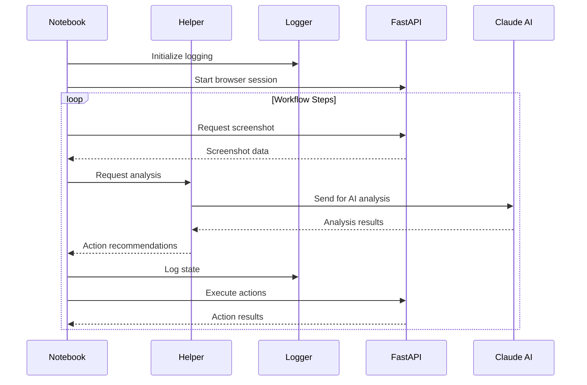

# Architecture Overview

## Core Components



### Component Descriptions

1. **Jupyter Notebook (`crawl.ipynb`)**
   - Primary control center and orchestrator
   - Manages entire workflow execution
   - Coordinates all other components
   - Handles high-level workflow decisions
   - Interacts with FastAPI server for browser control
   - Uses helper functions for analysis
   - Uses logger for state tracking
   - Directly manages file system operations

2. **Helper Functions (`helper.py`)**
   - Primary interface to Claude AI
   - Handles image analysis and processing
   - Contains core decision-making logic
   - Manages coordinate calculations
   - Provides utility functions for notebook
   - Interacts with file system for image handling
   - Makes requests to FastAPI server as needed

3. **Logging System (`hlogger.py`)**
   - Provides hierarchical logging structure
   - Manages state persistence
   - Handles process documentation
   - Controls file system organization
   - Used by all components for tracking

4. **FastAPI Server (`fastAPIServ.py`)**
   - Manages Playwright browser instance
   - Handles browser automation tasks
   - Takes screenshots
   - Executes UI interactions
   - Controlled by notebook and helper functions

## Data Flow

### 1. Main Workflow Flow


## Folder Structure

```
sync-crawl/
├── clients/                   # Managed by Logger
│   └── [client_name]/        # Client-specific data
│       └── [workflow_id]/    # Workflow instances
│           └── [sample_id]/  # Execution samples
├── crawl.ipynb               # Main control notebook
├── fastAPIServ.py           # Browser automation server
├── helper.py                # AI and analysis functions
├── hlogger.py              # Logging system
└── log_config.py           # Logging configuration
```

Here's a breakdown of each component:

### Client

*   **Description:** The top-level entity that initiates requests or interacts with the system. This could represent an end-user, an automated script, or another system component.
*   **Role:** Triggers the execution of specific `Workflows`.

### Workflow

*   **Description:** A predefined template or definition of a process. It outlines the sequence of operations or the overall task to be accomplished.
*   **Role:** Acts as a blueprint for execution. A single `Workflow` definition can be instantiated multiple times as `Samples`/`Tests`.

### Sample (A.K.A. Test)

*   **Also Known As:** `Test`
*   **Description:** A specific instance or execution of a `Workflow`. It often corresponds to a particular dataset, configuration, or scenario being processed.
*   **Role:** Represents a single, complete execution unit of the defined `Workflow`. It contains one or more `Runs`/`Steps`.

### Run (A.K.A. Step)

*   **Also Known As:** `Step`
*   **Description:** A distinct stage, task, or unit of work within a `Sample`/`Test`. A `Sample`/`Test` is typically composed of multiple `Runs`/`Steps` executed sequentially or in parallel, depending on the `Workflow` definition.
*   **Role:** Represents a discrete part of the overall `Sample`/`Test` execution. It can potentially be retried if it fails and contains specific `Actions`/`Step Actions` to be performed.

### Run Retry (A.K.A. Step Retry)

*   **Also Known As:** `Step Retry`
*   **Description:** Represents a specific attempt to execute a `Run`/`Step`. This component embodies the retry logic. If a `Run`/`Step` fails, one or more `Run Retries`/`Step Retries` may be initiated according to predefined rules.
*   **Role:** Manages the execution attempt of a `Run`/`Step`, particularly important for handling transient failures. A `Run`/`Step` might have an initial attempt and subsequent retry attempts.

### Action (A.K.A. Step Action)

*   **Also Known As:** `Step Action`
*   **Description:** A specific, fine-grained operation or command executed *within* a `Run`/`Step` (or a specific `Run Retry`/`Step Retry`). These are the lowest-level executable tasks.
*   **Role:** Defines the actual work performed during a `Run`/`Step`. This might involve calculations, API calls, data manipulation, etc. It may involve evaluating `Candidates`/`Step Action Candidates`.

### Candidate (A.K.A. Step Action Candidate)

*   **Also Known As:** `Step Action Candidate`
*   **Description:** Represents a potential choice, parameter, configuration, or outcome related to an `Action`/`Step Action`. An `Action`/`Step Action` might evaluate multiple `Candidates`/`Step Action Candidates` before proceeding or selecting a result.
*   **Role:** Provides options or potential pathways/results for a specific `Action`/`Step Action`.
## Execution Flow

A typical execution follows this sequence:

1.  A `Client` requests the execution of a `Workflow`.
2.  The system creates a new `Sample` (A.K.A. `Test`) instance based on the `Workflow` definition.
3.  The `Sample`/`Test` begins processing its defined sequence of `Runs` (A.K.A. `Steps`).
4.  For each `Run`/`Step`:
    *   An initial attempt (conceptually the first `Run Retry`/`Step Retry`) is made.
    *   Within this attempt, the required `Actions` (A.K.A. `Step Actions`) are executed.
    *   `Actions`/`Step Actions` may involve evaluating or selecting from `Candidates` (A.K.A. `Step Action Candidates`).
    *   If the `Run`/`Step` (or its `Actions`/`Step Actions`) fails:
        *   Retry logic is checked. If retries are permitted, a new `Run Retry` (A.K.A. `Step Retry`) attempt is initiated for the same `Run`/`Step`.
        *   This continues until the `Run`/`Step` succeeds or the maximum number of retries is exhausted.
    *   If the `Run`/`Step` succeeds (on any attempt), the `Sample`/`Test` proceeds to the next `Run`/`Step`.
5.  The `Sample`/`Test` completes when all its `Runs`/`Steps` have successfully executed or when a non-recoverable failure occurs.


## Key Processes

### 1. Workflow Execution
1. Notebook initializes workflow
2. Logger creates folder structure
3. Helper prepares for analysis
4. FastAPI server starts browser session
5. Workflow steps execute through notebook

### 2. Analysis Process
1. Notebook requests screenshot via FastAPI
2. Helper receives screenshot for analysis
3. Helper sends to Claude AI
4. Claude AI returns analysis
5. Helper processes results
6. Notebook receives action recommendations

### 3. Logging Process
1. Logger creates hierarchical structure
2. Components send logs to logger
3. Logger manages state persistence
4. Logger organizes artifacts
5. Logger maintains process documentation

## System States

1. **Initialization**
   - Notebook starts workflow
   - Logger creates structure
   - FastAPI connects to browser
   - Helper prepares for analysis

2. **Execution**
   - Notebook orchestrates flow
   - Helper performs analysis
   - FastAPI executes actions
   - Logger tracks state

3. **Error Recovery**
   - Notebook manages recovery
   - Helper analyzes failure
   - Logger maintains state
   - FastAPI resets browser if needed

## Performance Considerations

1. **Resource Management**
   - Notebook controls execution flow
   - Helper manages AI requests
   - FastAPI handles browser resources
   - Logger optimizes file operations

2. **Error Handling**
   - Notebook provides high-level recovery
   - Helper validates analysis
   - FastAPI manages browser stability
   - Logger ensures state consistency

3. **State Management**
   - Notebook tracks workflow progress
   - Helper maintains analysis context
   - Logger persists system state
   - FastAPI maintains browser state


