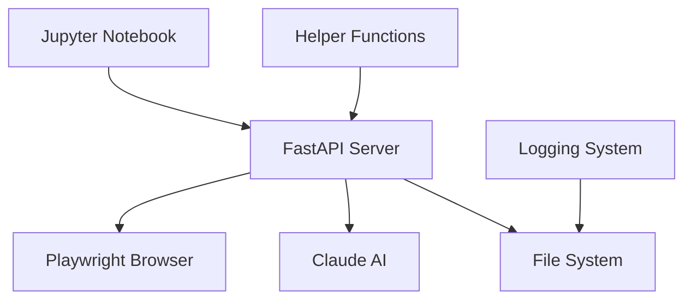
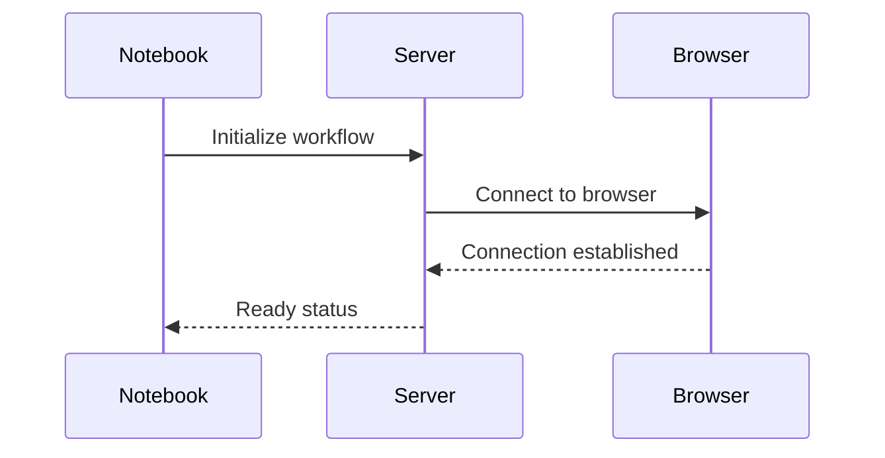
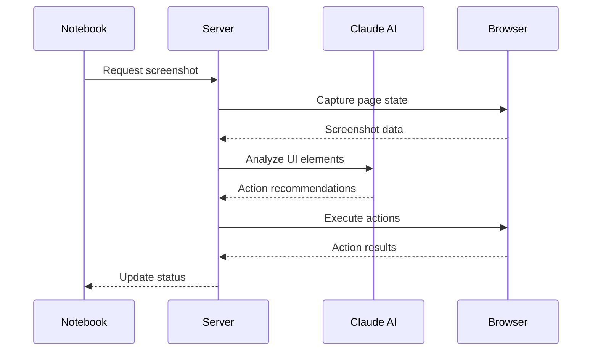

# Architecture Overview

## System Components



### Component Descriptions

1. **Jupyter Notebook (`crawl.ipynb`)**
   - Entry point for workflow execution
   - Manages workflow state and progression
   - Coordinates between components
   - Handles high-level error recovery

2. **FastAPI Server (`fastAPIServ.py`)**
   - Browser automation coordination
   - Screenshot management
   - Element interaction
   - State validation
   - API endpoints for system control

3. **Helper Functions (`helper.py`)**
   - AI integration
   - Image processing
   - Coordinate calculation
   - File management
   - Analysis utilities

4. **Logging System (`hlogger.py`)**
   - Hierarchical data structure
   - Process documentation
   - State tracking
   - Error logging

## Data Flow

### 1. Workflow Initialization


### 2. Action Execution


## Folder Structure

```
sync-crawl/
├── clients/
│   └── [client_name]/
│       └── [workflow_id]/
│           └── [sample_id]/
│               └── [rerun_id]/
│                   └── [run_id]/
│                       └── [run_retry_id]/
│                           ├── dots/
│                           ├── temp/
│                           ├── highlights/
│                           └── chunks/
├── docs/
├── .venv/
├── crawl.ipynb
├── fastAPIServ.py
├── helper.py
├── hlogger.py
├── log_config.py
├── requirements.txt
└── README.md
```

## Key Processes

### 1. UI Analysis
- Screenshot capture
- Element detection
- Coordinate mapping
- Visual validation

### 2. Action Planning
- Context analysis
- Element prioritization
- Action sequencing
- Validation rules

### 3. Execution
- Browser manipulation
- State verification
- Error handling
- Result logging

### 4. Documentation
- Process tracking
- State recording
- Error documentation
- Result analysis

## System States

1. **Initialization**
   - Browser connection
   - Server startup
   - Resource verification

2. **Active Crawling**
   - Element analysis
   - Action execution
   - State tracking

3. **Error Recovery**
   - State rollback
   - Alternative path selection
   - Error documentation

4. **Completion**
   - Goal verification
   - Resource cleanup
   - Documentation finalization

## Interactions with External Systems

### 1. Browser
- Chrome debugging protocol
- Playwright automation
- Screenshot capture
- DOM manipulation

### 2. AI Services
- Claude API integration
- Image analysis
- Decision making
- Action validation

### 3. File System
- Screenshot storage
- Log management
- State persistence
- Documentation generation

## Performance Considerations

1. **Resource Management**
   - Memory usage monitoring
   - Browser instance control
   - File system optimization

2. **Error Handling**
   - Graceful degradation
   - State recovery
   - Process continuation

3. **Scalability**
   - Parallel workflow support
   - Resource isolation
   - Load management